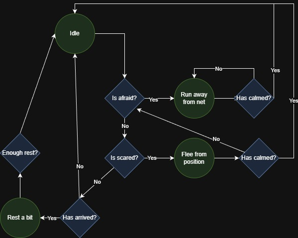

# Carnival VR

A WIP project with the idea of creating an experience of a carnival full of fun mini-games to pass the time and have a blast.

## Fish AI

In this game we find a catch the fish mini-game.

Here your objective is to catch fishes while using a small net.

This behavior can be find in <a href="Assets\Scripts\FishAI">this</a> folder.

For this game the fish has the behavior shown in the following diagram:

And works as follows: 

## States 
### Idle 

Moves the fish in XZ using a Unity's nav-mesh system, while the Y position is determined by the bounds of the fish tank.

### Run away from net

If the fish detects the new to close or moving to fast it will run away from it, always being inside the bounds of the tank.

### Flee from position 

The fish starts to actively run away from the net scaping and reacting to even the slightest move.

### Rest

Fish just stop for a moment before keep moving.

## Conditions

### Is Afraid?

Checks if net moved fast or is too close to fish.

### Is Scared?

If net has been close or moving fast many times Fish panics and starts fleeing.

### Has arrived? 

Checks if the fish reached it's destination

### Enough rest?

Checks if the fish is ready to keep swimming (time based).

### Has calmed

Checks if the last time the net was detected is long enough to feel "safe" and keep idling.